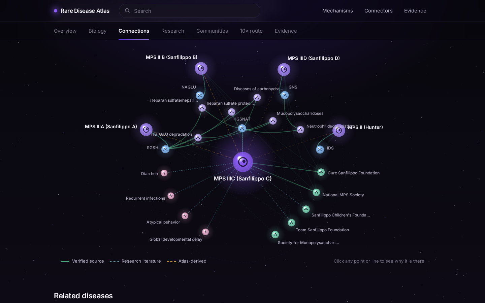
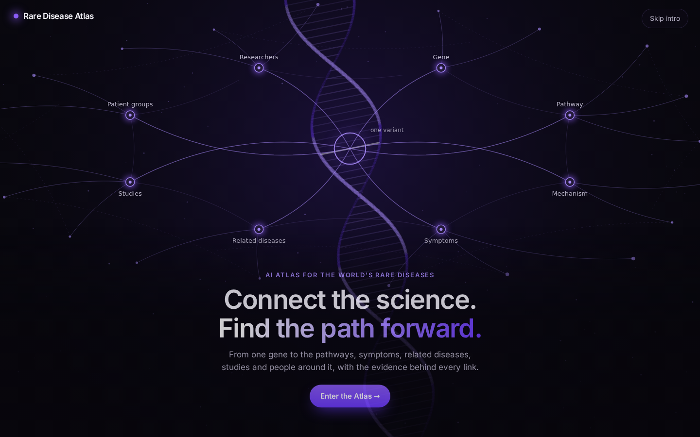
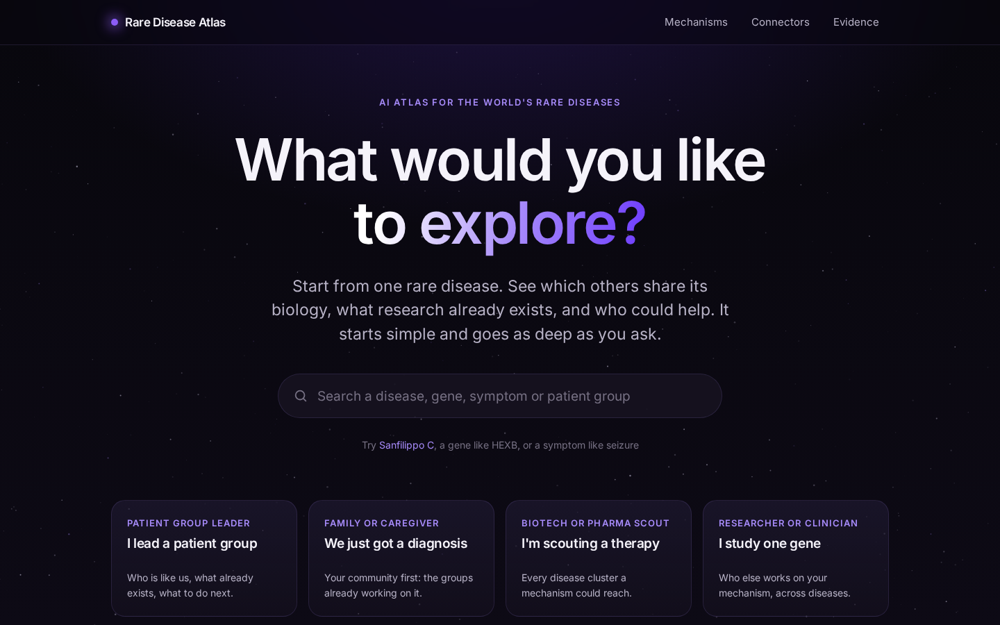
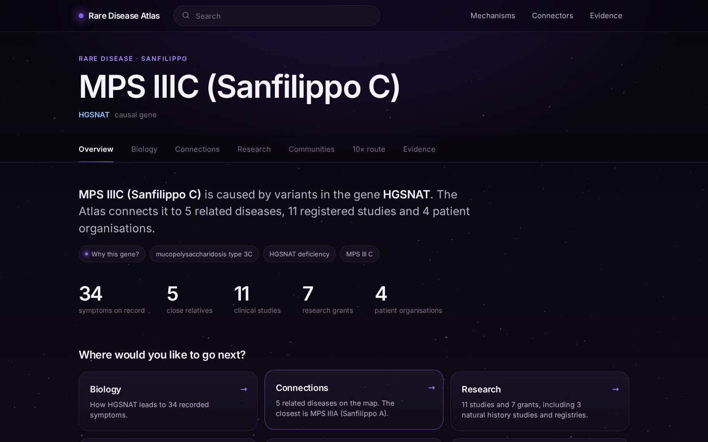
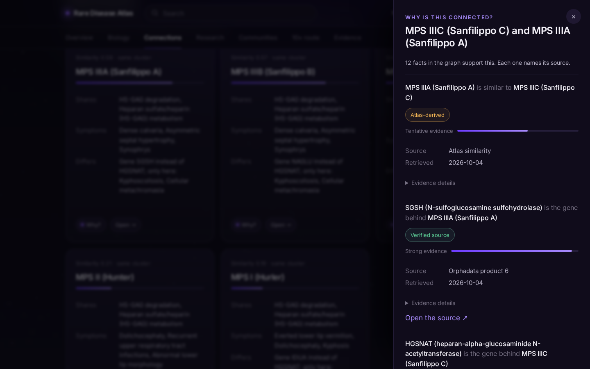
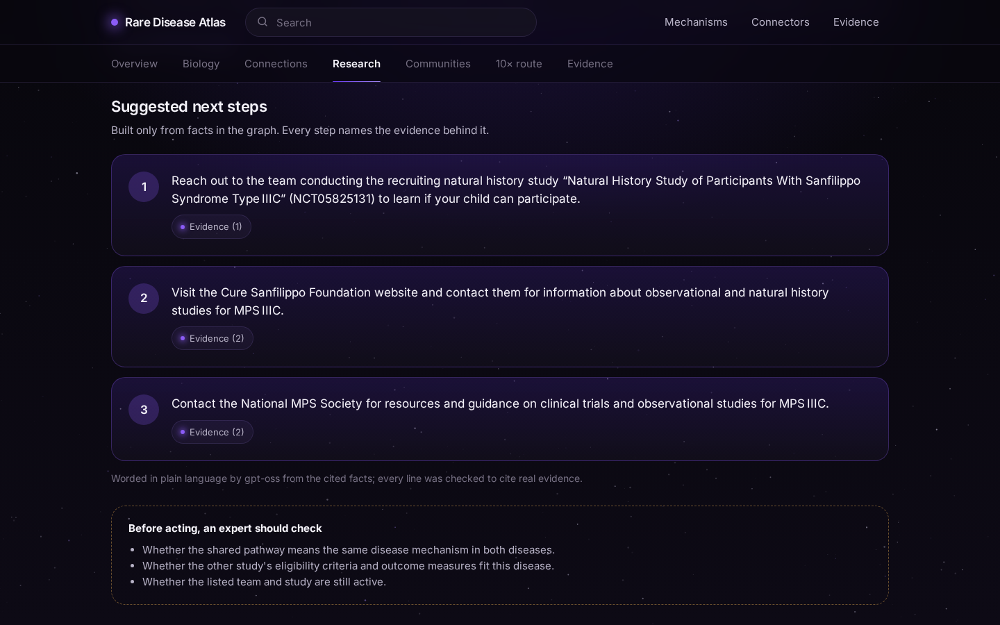

# Rare Disease Atlas

**Start from one rare disease. See which others share its biology, what research already exists, who could help, and what to do next. Every connection shows its source.**

Built for the Hack-Nation challenge "AI Atlas for the World's Rare Diseases" (OpenAI × Buffalo Initiative). It covers 22 rare neurological diseases (Sanfilippo/MPS III, Batten/NCL, Niemann-Pick C, Tay-Sachs and others) as an evidence-tracked knowledge graph with a website on top.

> Research exploration tool. Not medical advice.



---

## Run it in two minutes

You need **[uv](https://docs.astral.sh/uv/getting-started/installation/)** (it installs the right Python for you). Nothing else: no API keys, no Node, no database. The graph and the website are already built and included.

```bash
git clone https://github.com/krishna27-spec/rare-disease-atlas2
cd rare-disease-atlas2
uv sync
uv run uvicorn src.atlas.server:app --port 8000
```

Then open **http://localhost:8000**.

| Address | What it is |
|---|---|
| http://localhost:8000 | The website |
| http://localhost:8000/docs | The API, with a "Try it out" button on every endpoint |

**Optional:** to get the three "next steps" written in plain language by gpt-oss, copy `.env.example` to `.env` and put a Groq API key in `LLM_API_KEY`. Without it the same steps are shown in the Atlas's own wording, with the same evidence.

---

## A three-minute tour

Follow Maria, who leads a patient group for **MPS IIIC (Sanfilippo C)**, a disease with no approved treatment.

| Step | Do this | What you should see |
|---|---|---|
| 1 | Open the site and click **Enter the Atlas** | A DNA helix, one variant, and its signal growing into a network |
| 2 | Type `sanfilipo c` (typo on purpose) and press Enter | The search still finds MPS IIIC |
| 3 | Read the **Overview** tab | One paragraph, five numbers, and a tile for each deeper view |
| 4 | Open **Connections** | The map draws itself in stages. Click **Expand connections** to add patient groups and symptoms |
| 5 | Click any line on the map, or any **Why?** button | A drawer with the source, date, strength and the quoted sentence |
| 6 | Open **Research** | Existing natural history studies first, then three cited next steps |
| 7 | Open **10× route** | A natural history study from scratch versus reusing what related diseases built, with real durations |
| 8 | Search `cystic fibrosis` | An honest "nothing matches", with what was searched |

Steps 5 and 8 are the two things the Atlas is built around: **nothing is shown without evidence, and gaps are stated instead of filled.**

| | |
|---|---|
|  |  |
|  |  |



---

## Who it is for

The brief names four people. Each has a door on the home page.

| Person | Their question | Where the Atlas answers it |
|---|---|---|
| **Maria**, patient group leader | Who is like us, what exists, what do we do next? | A disease page: Connections, Research, Communities, 10× route |
| **Devon**, newly diagnosed family | Is there a community for this? | A disease page, opened on **Communities** |
| **Priya**, biotech scout | Which diseases could one mechanism treat? | **Mechanisms**: enter a pathway or gene, get ranked disease clusters |
| **Dr. Osei**, researcher | Who else works on my mechanism? | **Connectors**: people whose trials, grants or papers span several diseases |

## What is on a disease page

Seven tabs, from least to most detail:

| Tab | What it shows |
|---|---|
| **Overview** | One paragraph, five numbers, a one-line summary of every other tab |
| **Biology** | Disease → gene → mechanisms → symptoms, the most specific first |
| **Connections** | The map, the related diseases with what is shared and what differs, and the cited path between them |
| **Research** | Reusable studies and registries, three cited next steps, researchers |
| **Communities** | Patient organisations (with the sentence from their own website), related communities |
| **10× route** | Starting a natural history study: from scratch versus reusing relatives' work, for every disease |
| **Evidence** | How many facts of each kind, and what papers say, with quotes and a second model's verdict |

---

## How it meets the judging criteria

| Criterion | What we built |
|---|---|
| **Graph quality** | 10 node types, 9 relation types, stable IDs (MONDO, HGNC, HPO, Reactome, GO, PMID, NCT). Clusters come from shared mechanisms and informative symptoms, not from disease names. Weak matches are labelled, not hidden. |
| **Evidence integrity** | Every fact stores its source, date, strength and kind. Facts read from papers are kept only if the quoted sentence is in the abstract word for word, then a second model checks them. A check script fails the build if any rule is broken. |
| **Patient progress** | Search → related disease → shared mechanism → existing study → patient group → cited next step, with "what an expert must check" beside it. |
| **10× impact** | One milestone (a natural history study), real registered durations, stated assumptions, and no claimed saving without a source. |
| **Product craft** | Starts with one paragraph and grows on request; one evidence drawer for every claim; honest empty states. |
| **Built with OpenAI** | gpt-oss (OpenAI's open-weight models) does three jobs: extract facts from abstracts, review each extracted fact, and word the next steps. Code verifies each one. |

---

## How it works

```
 Public sources              Build (offline)                What ships              What you use
┌──────────────────┐    ┌─────────────────────────┐    ┌──────────────────┐    ┌──────────────────┐
│ MONDO, HPO,      │    │ src/etl     read sources│    │ data/graph/      │    │ src/atlas   API  │
│ Orphadata, HGNC, │ ─► │ src/extract gpt-oss     │ ─► │  nodes.parquet   │ ─► │ web/        site │
│ Reactome, GO,    │    │   reads abstracts       │    │  edges.parquet   │    │ (one process,    │
│ ClinVar, PubMed, │    │ src/graph   join, score,│    │  + small tables  │    │  one command)    │
│ ClinicalTrials,  │    │   review, check         │    │                  │    │                  │
│ NIH RePORTER,    │    └─────────────────────────┘    └──────────────────┘    └──────────────────┘
│ patient-group    │
│ websites         │
└──────────────────┘
```

The graph is built once, offline, and saved as small files. The website and API only read those files, so they start in a second and need no keys.

### The three kinds of evidence

| Shown as | Meaning | On the map |
|---|---|---|
| **Verified source** | Copied from a curated database or registry | Solid green line |
| **Research literature** | Read from a paper by gpt-oss, or from a patient organisation's own website. The exact sentence is stored. | Dotted cyan line |
| **Atlas-derived** | Computed by the Atlas (disease similarity). A lead to check, not an observation. | Dashed amber line |

### Where gpt-oss is used, and how it is checked

| Job | Model | The check that follows |
|---|---|---|
| Extract facts from PubMed abstracts | gpt-oss-20b and gpt-oss-120b | The quoted sentence must be in the abstract word for word; names must match IDs already in the graph |
| Review each extracted fact | gpt-oss-120b | It sees only the claim, the quote and the paper title; its verdict is stored on the fact |
| Word the next steps in plain language | gpt-oss-120b | Every line must cite fact IDs that were given to it, or the line is dropped |

### What is in the graph

22 diseases · 23 genes · 674 symptoms · 209 mechanisms · 342 clinical studies · 126 reusable assets · 233 grants · 606 researchers · 60 papers · 20 patient organisations, joined by about 3,960 facts. Full counts, including how many extracted facts were dropped and why, are in [`data/graph/STATS.md`](data/graph/STATS.md).

---

## Rebuild the dataset

You do not need to do this to use the site. It is here so the result can be reproduced.

```bash
cp .env.example .env                 # add NCBI_API_KEY and NCBI_EMAIL for PubMed (optional but faster)
uv run python -m src.graph.build     # downloads sources (about 230 MB) on the first run, then builds and checks
```

The build runs these steps in order and stops if the evidence check fails:

`download → biology → research → Gene Ontology → patient organisations → timelines → similarity → text-mined facts → review → connections → statistics → check`

What to expect:

- **The gpt-oss results are included** (`data/cache/extractions.jsonl`, `reviews.jsonl` and the abstracts they came from), so a rebuild reuses them and needs no LLM quota.
- **Trials, grants, papers and organisation pages are fetched live** on a fresh clone, so counts can shift slightly as those sources update.
- To read more abstracts or review more facts, add an LLM key to `.env` and run `uv run python -m src.extract --spread --limit 60`, then `uv run python -m src.graph.review`, then the build again.

Changing the website needs Node 20+: `cd web && npm install && npm run build`.

---

## What it does not do yet

- **22 diseases only**, hand-picked. Adding one means adding a row to `data/manual/diseases.csv` and rebuilding.
- **120 of 712 relevant abstracts have been read**, limited by free model quota. Paper facts add to the database facts; they do not replace them.
- **19 of 117 paper facts are not yet reviewed**, and earlier verdicts came from a stricter prompt, so some correct facts are marked "not supported".
- **No contradictions were found.** The extraction records denials, but the four it found were about diseases outside the 22.
- **Patient organisations:** 5 were read by a person; 15 are linked because their own website names the disease repeatedly. Registry mentions are sentences from their sites, not verified registries.
- **The Connectors ranking counts breadth only.** It does not yet weigh whether a study ran or how recent it is, so the top entry can be someone listed on withdrawn studies.
- **Similarity uses Reactome pathways and HPO symptoms.** Four Batten genes have no Reactome pathway, so that cluster rests on symptoms; Gene Ontology fills the gap for navigation but not for scoring.
- **Desktop only.** There is no mobile layout, and the site is not deployed to a public URL.

---

## Where things are

| Path | What it is |
|---|---|
| `web/` | The website (React). `web/dist` is the built site the server serves. |
| `src/atlas/` | The API (`server.py`) and the query functions behind it (`queries.py`) |
| `src/etl/`, `src/graph/`, `src/extract.py`, `src/llm.py` | The build: reading sources, gpt-oss extraction and review, similarity, checks |
| `data/graph/` | The built graph. `STATS.md` has the numbers. |
| `data/manual/` | Hand-maintained inputs: the disease list and patient organisations |
| `docs/BACKEND_GUIDE.md` | How the backend works, in plain language |
| `docs/BACKEND_API.md` | Every endpoint and what it returns |
| `docs/challenge-brief.pdf` | The challenge brief |
| `CLAUDE.md` | Notes for working on the code |

## Credits

The intro animation, the staged map reveal and the plain evidence labels come from the Streamlit redesign in [krishna27-spec/rare-disease-atlas](https://github.com/krishna27-spec/rare-disease-atlas), rebuilt here on the new backend. Data: MONDO, HPO, Orphadata (CC BY 4.0), HGNC, Reactome, Gene Ontology, ClinVar, PubMed, ClinicalTrials.gov, NIH RePORTER.
